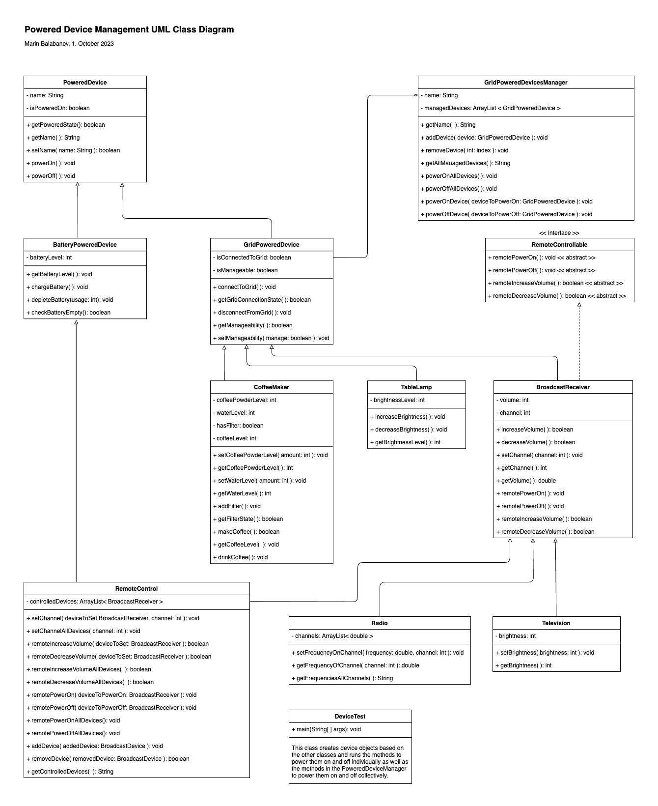

# Powered Device Management
A system for the management of grid-powered devices.

## About
In general, any powered device can be powered on and off individually. There are two types of powered devices:
- GridPoweredDevices
- BatteryPoweredDevices

There are four types of grid-powered devices:
- CoffeeMaker
- TableLamp
- Radio (BroadCastReceiver)
- Television (BroadCastReceiver)

There is one type of BatteryPoweredDevice:
- RemoteControl

The GridPoweredDeviceManager can power multiple or all grid-powered devices on and off. Radio and Television are a type of device called BroadcastReceivers can be controlled by a RemoteControl. The RemoteControl is a battery-powered device, it cannot be controlled by the GridPoweredDeviceManager but it can be used to control the Radio and the Television.

## Run
The tests are defined in `main` in the class `DeviceTest`. Execute `DeviceTest` to run through all the tests.

## UML Class Diagram

